# ✦ Hello World, I'm Aaryan! ✦

<div align="center">
  <!-- Premium Header Banner -->
  <a href="https://github.com/Aaryanvyas">
    
  </a>

  <br/><br/>

  <!-- Tagline & Quick Stats -->
  <p align="center">
    <strong>Full-Stack Software Engineer &amp; Designer</strong> • Crafting High-Performance Interactive Web Experiences
  </p>

  <p align="center">
    <a href="https://github.com/Aaryanvyas"></a>
    <a href="https://github.com/Aaryanvyas"></a>
    <a href="mailto:aryanvyas456@gmail.com"></a>
  </p>
</div>

---

## ⚡ About Me

```javascript
const developer = {
  name: "Aaryan Vyas",
  role: "Full-Stack Engineer & Designer",
  skills: ["Frontend", "Backend", "Cloud Architecture", "UI/UX Design"],
  currentProject: "Optimizing cloud microservices & designing sleek interfaces",
  philosophy: "Simplicity is the ultimate sophistication."
};
```

* 🚀 I specialize in building robust, interactive web applications with a focus on polished visuals and high performance.
* 🎨 Passionate about UI/UX design, micro-animations, and theme systems.
* 🛠️ Constantly exploring cloud infrastructure, edge-computing, and modular design patterns.
* 📬 Reach out at [aryanvyas456@gmail.com](mailto:aryanvyas456@gmail.com) for collaboration!

---

## 🛠️ My Tech Stack

### 💻 Frontend Architecture & Styling
<p align="left">
  
  
  
  
  
  
</p>

### ⚙️ Backend & Database Systems
<p align="left">
  
  
  
  
  
</p>

### 🛠️ Developer Tools & Design
<p align="left">
  
  
  
  
</p>

---

## 📊 GitHub Metrics & Statistics

<div align="center">
  <table border="0">
    <tr>
      <!-- Stats Card -->
      <td width="50%" align="center" style="border: none;">
        
      </td>
      <!-- Top Languages Card -->
      <td width="50%" align="center" style="border: none;">
        
      </td>
    </tr>
    <tr>
      <!-- Streak Card (Spans across or centered below) -->
      <td colspan="2" align="center" style="border: none; padding-top: 15px;">
        
      </td>
    </tr>
  </table>
</div>

---

<div align="center">
  <p><i>Made with 💜 and GitHub Aura principles. Visitors to this page see pure neon magic.</i></p>
  <a href="https://github.com/Aaryanvyas"></a>
</div>
